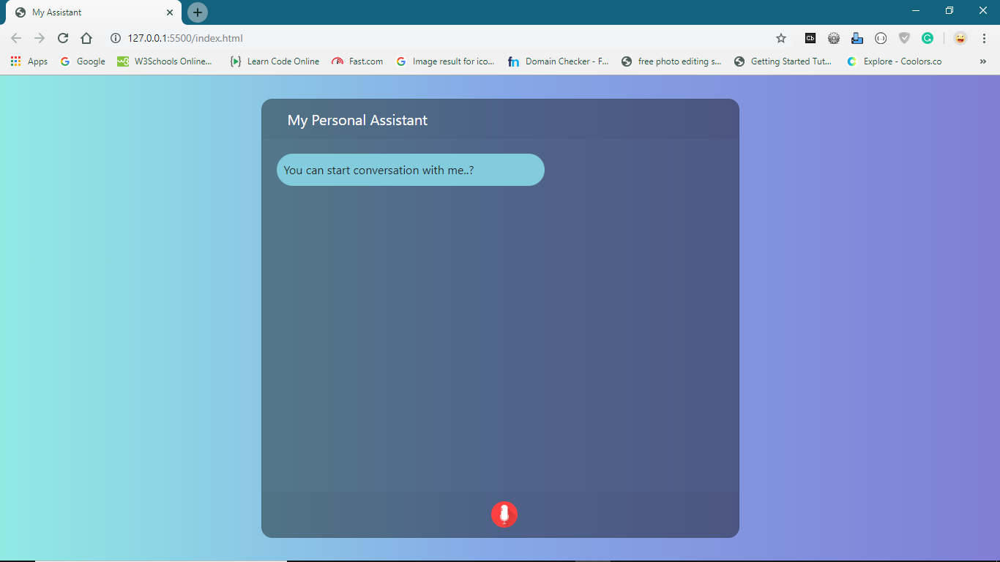
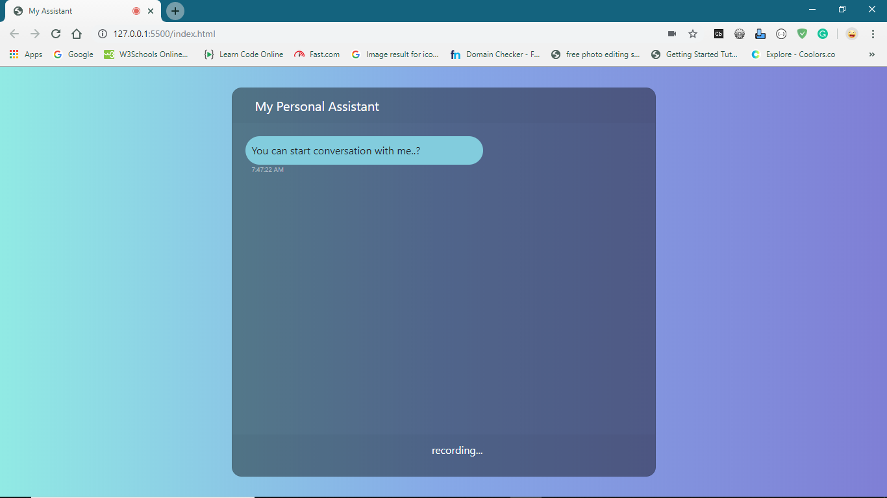
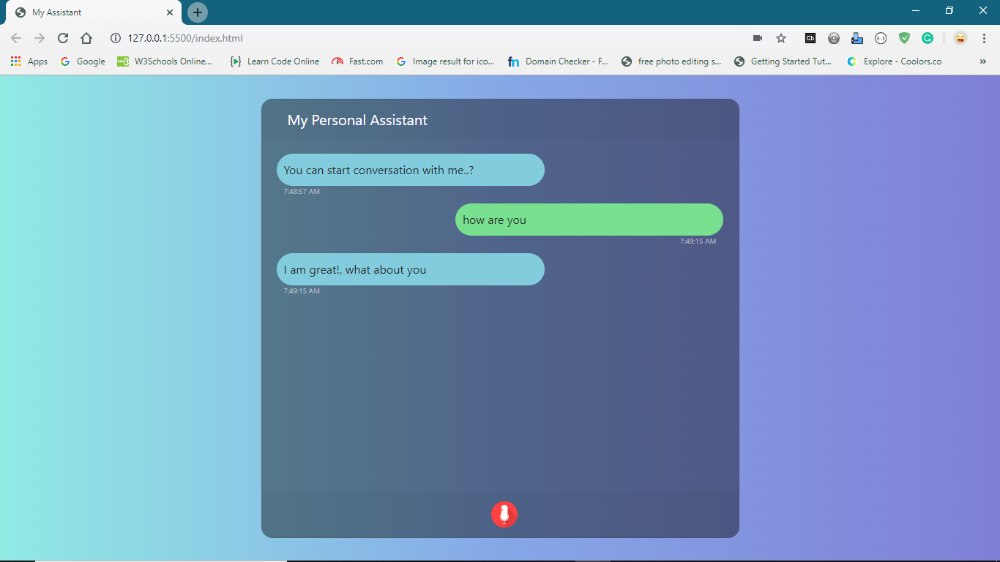
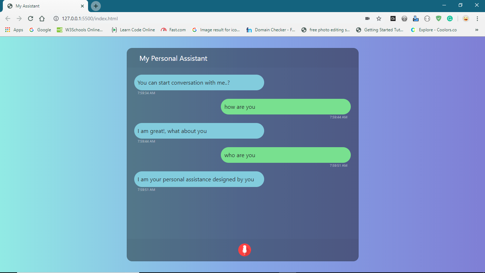

# My Personal Assistant

## How It Works

### 1. Initially Homepage is :

### 2. Clicking on mic will start recording :

### 3. After recogniging voice appropriate output to the command will be displayed on screen as assistant chat :

### 4. Try another command as test :

### 5. We can add more commands and outputs in JS/app.js file shown in below image:

